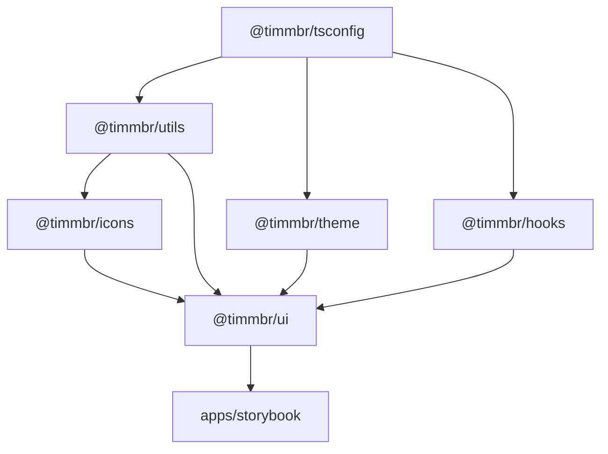

# Architecture & Technical Deep Dive

The Timmbr Design System is built to solve the challenges of scalable, modern React engineering, specifically addressing **Next.js App Router (React Server Components)** compatibility, high-velocity developer experience, strict styling distribution, and zero-runtime-overhead configuration.

---

## 1. Monorepo Structure

```text
timmbr-ds/
├── apps/
│   └── storybook/                 # Storybook 10 + Vite + Next.js App Router mock environment
├── packages/
│   ├── ui/                        # @timmbr/ui: Radix UI primitives + Tailwind CSS v4 components
│   ├── icons/                     # @timmbr/icons: Lucide wrappers & custom SVGs
│   ├── hooks/                     # @timmbr/hooks: Shared React hooks
│   ├── utils/                     # @timmbr/utils: Pure JS/TS helpers (cn, formatters)
│   ├── theme/                     # @timmbr/theme: Tailwind v4 @theme, tokens, and CSS variables
│   ├── config-typescript/         # @timmbr/tsconfig: Shared TS configurations
│   └── config-eslint/             # @timmbr/eslint-config: Shared ESLint rules
├── .agents/                       # Workspace skills for Antigravity AI agents
├── docs/                          # Architectural and pattern documentation
├── turbo.json                     # Turborepo 2 pipeline configuration
├── pnpm-workspace.yaml            # PNPM workspace boundaries
└── .changeset/                    # Semantic release management
```

---

## 2. Turborepo Dependency Graph

Turborepo manages topological task execution, ensuring dependencies build in strict hierarchical order:



---

## 3. Next.js App Router & RSC Compatibility

A common pitfall in modern design systems is bundling an entire component library into a single monolithic bundle. When a single component has `'use client'`, the entire bundle is marked as a Client Component, breaking React Server Components (RSC) tree-shaking and preventing server rendering.

Timmbr solves this using:
1. **`rollup-plugin-preserve-directives`**: Preserves individual `'use client'` statements on emitted JavaScript files.
2. **`preserveModules: true`**: Outputs each source module to a corresponding discrete file in `dist/`.
3. **External Dependencies**: Consumer dependencies (`react`, `react-dom`, `@radix-ui/*`) are never bundled into the library.

---

## 4. Tailwind CSS v4 Distribution Strategy

Instead of compiling CSS inside `@timmbr/ui` (which causes duplicate CSS and specificity collisions), Timmbr uses Tailwind CSS v4's native `@theme` layer:

1. `@timmbr/theme` exports `theme.css` with a `@theme` block.
2. Consuming applications import `@timmbr/theme/theme.css` in their root stylesheet.
3. Consuming applications define `@source` directives targeting `@timmbr/ui` and `@timmbr/icons`.
4. Tailwind scans classes JIT directly from the component distributions!
